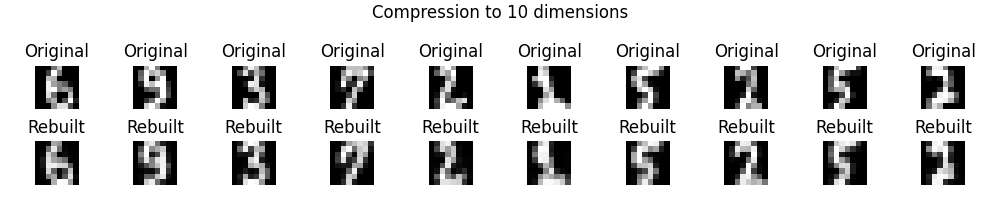

# Rapport de projet : ML

## Introduction

Ce projet vise à explorer la compression, la reconstruction et la classification des données à l’aide de réseaux de neurones, notamment des auto-encodeurs. Pour cela, nous avons développé une bibliothèque modulaire de réseaux de neurones incluant des couches linéaires (`Linear`), des fonctions d’activation, des fonctions de perte et des optimiseurs. Nous avons mené cinq expériences pour valider chaque composant, avec en point d’orgue un auto-encodeur pour la reconstruction d’images compressées.

---

## Test 1 : Module linéaire + MSELoss (entraînement manuel)

**Objectif :**
Comprendre les étapes de base de l’apprentissage d’un réseau de neurones en implémentant manuellement la propagation avant, la rétropropagation et la mise à jour des paramètres.

**Méthode :**

* Données d’entrée `X` : deux exemples, chacun un vecteur de dimension 2 (`[[1.0, 2.0], [3.0, 4.0]]`).
* Sortie attendue `Y` : `[[1.0], [0.0]]`.
* Réseau composé uniquement d’une couche `Linear(2 → 1)` sans activation.
* Fonction de coût : `MSELoss` (erreur quadratique moyenne).
* Étapes réalisées manuellement :

  1. Propagation avant pour obtenir `Y_hat`.
  2. Calcul de la perte avec `Y` et `Y_hat`.
  3. Calcul des gradients par rétropropagation.
  4. Mise à jour des paramètres avec un taux d’apprentissage `0.01`.
  5. Recalcul de la perte après mise à jour.

**Résultat :**

* Perte initiale : `[0.994, 0.000096]`
* Perte après mise à jour : `[0.880, 0.0161]`

**Conclusion :**
Cette expérience met en place la base de l’apprentissage par descente de gradient. Les étapes manuelles ici seront progressivement automatisées à l’aide de modules (`Optim`, `SGD`, etc.) dans les tests suivants.

---

## Test 2 : Classification binaire sur données gaussiennes

**Objectif :** Construire un réseau peu profond pour résoudre une tâche de classification binaire sur données 2D, avec visualisation des performances.

**Méthode :**

* Deux nuages de points gaussiens générés (classe 0 et 1, 100 points chacun).
* Séparation en ensemble d’apprentissage et de test.
* Réseau :

  * `Linear(2 → 5)`
  * `TanH`
  * `Linear(5 → 1)`
  * `Sigmoide`
* Fonction de coût : `MSELoss`.
* Entraînement : 1000 époques avec taux d’apprentissage `0.1`.
* Suivi du loss et de la précision sur les ensembles train/test.

**Résultat :**

* Bonne séparation des classes.
* Courbes de perte et précision montrant une convergence stable.

**Illustration :**

---

## Test 3 : Problème XOR non-linéaire

**Objectif :** Résoudre un problème non-linéaire (XOR) pour évaluer la capacité du réseau à modéliser des frontières complexes.

**Méthode :**

* Données XOR générées à partir de 4 clusters.
* Réseau :

  * `Linear(2 → 10)`
  * `TanH`
  * `Linear(10 → 1)`
  * `Sigmoide`
* Fonction de coût : `CrossEntropyLoss`.
* Utilisation des classes `Sequentiel`, `Optim`, `SGD` pour automatiser l’entraînement (mini-batchs).

**Résultat :**

* Précision proche de 100%.
* Frontière de décision bien apprise, démontrant la capacité de généralisation du modèle.

**Illustration :**

---

## Test 4 : Classification multiclasse (Softmax + one-hot)

**Objectif :** Effectuer une classification à trois classes avec encodage one-hot et softmax.

**Méthode :**

* Données générées depuis 3 centres gaussiens.
* Étiquettes transformées en one-hot.
* Réseau :

  * `Linear(2 → 10)`
  * `TanH`
  * `Linear(10 → 3)`
  * `Softmax`
* Fonction de perte : `CrossEntropyLoss`.
* Entraînement avec `SGD` sur 1000 époques.

**Résultat :**

* Précision de classification très élevée.
* Classification visuellement correcte par zones.

**Illustrations :**

---

## Test 5 : Auto-encodeur – Compression et reconstruction (10 dimensions)

**Objectif :** Apprendre une représentation compressée (10 dimensions) des images 8×8 du jeu de données `digits`, puis reconstruire les images.

**Méthode :**

* Données : `load_digits` de sklearn (valeurs normalisées entre 0 et 1).
* Réseau :

  * **Encodeur** : `Linear(64 → 32)` → `TanH` → `Linear(32 → 10)` → `TanH`
  * **Decodeur** : `Linear(10 → 32)` → `TanH` → `Linear(32 → 64)` → `Sigmoide`
* Perte : `MSELoss`
* Entraînement sur 500 époques.
* Visualisation de la reconstruction d’images testées.

**Résultat :**

* Bonne qualité de reconstruction malgré une compression importante.
* L’auto-encodeur apprend à capturer les traits essentiels des chiffres.

**Illustration :**

---

## Conclusion

Ce projet nous a permis de construire étape par étape une architecture de réseau de neurones modulaire. Nous avons :

* Mis en œuvre la propagation directe et rétropropagation à partir de zéro.
* Ajouté des fonctions d’activation pour modéliser la non-linéarité.
* Implémenté un pipeline complet d’entraînement avec `Optim` et `SGD`.
* Réussi à traiter des tâches de classification binaire, multiclasse, et de reconstruction par auto-encodeur.
