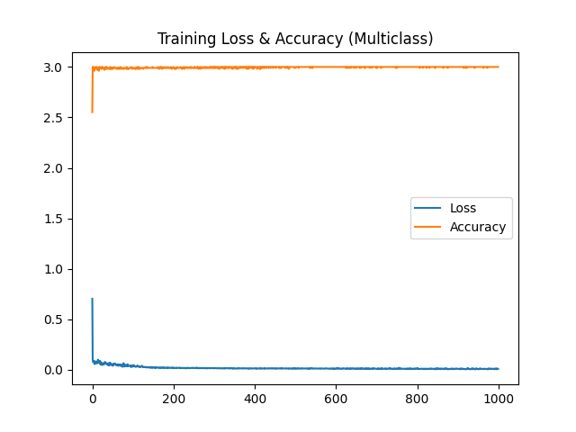

# 自动编码器项目报告

## 引言

本项目旨在通过自动编码器等神经网络结构，探索数据压缩、重建与分类任务的学习能力。我们使用了自行构建的模块化神经网络库（包括 Linear、激活函数、损失函数、优化器等）完成了 5 个测试任务，逐步引入网络训练所需的关键组件，最终实现了自动编码器的图像重建应用。

---

## 测试 1：线性模块 + MSELoss 手动训练演示

**目标：**
通过手动实现最小神经网络的正向传播、反向传播和参数更新机制，理解神经网络训练的基本步骤。

**方法：**

* 输入数据 `X` 是两个样本，每个样本为一个二维向量（`[[1.0, 2.0], [3.0, 4.0]]`）。
* 目标输出 `Y` 为对应的标签向量（`[[1.0], [0.0]]`）。
* 网络结构仅由一个 Linear 层组成（输入维度 2，输出维度 1），无激活函数。
* 损失函数使用 MSELoss（均方误差）。
* 手动完成以下流程：

  1. 正向传播得到预测值 `Y_hat`。
  2. 用 `Y` 与 `Y_hat` 计算损失。
  3. 通过反向传播得到梯度（对权重和偏置）。
  4. 用学习率 `0.01` 更新参数。
  5. 再次计算更新后的 loss。

**结果：**

* 初始 Loss: `[0.994, 0.000096]`
* 更新后的 Loss: `[0.880, 0.0161]`
* 可见参数优化有效地减小了误差。

**总结与引申：**
本测试展示了完整的前向传播、误差计算、反向传播和参数更新流程，是后续引入更复杂结构（激活函数、优化器封装、多层网络等）的基础。后续所有测试都基于这一基本思路，通过引入模块化机制提升可扩展性与代码清晰度。

---

## 测试 2：高斯分布二分类 + 网络训练可视化

**目标：** 使用浅层神经网络对二维数据集进行二分类任务，并可视化训练过程和最终分类结果。

**方法：**

* 生成两个二维高斯分布，分别对应类别 0 和 1，总共 200 个样本。
* 数据通过 `train_test_split` 分为训练集和测试集。
* 网络结构为：

  * Linear(2 → 5)
  * TanH 激活函数
  * Linear(5 → 1)
  * Sigmoide 激活函数
* 损失函数为 MSELoss。
* 学习率 `0.1`，训练 `1000` epoch。
* 在每个 epoch 中：

  * 完整前向传播
  * MSELoss 计算 loss
  * 利用链式调用的反向传播更新参数
  * 同时评估测试集性能

**结果：**

* Loss 和 Accuracy 随 epoch 稳定下降/上升。
* 测试集分类效果图显示模型成功学习了分界线。

**图示：**

---

## 测试 3：XOR 非线性问题分类

**目标：** 使用神经网络解决非线性可分问题（异或 XOR）。

**方法：**

* 生成 XOR 模式的二维样本。
* 使用模块 Sequentiel 封装：

  * Linear(2 → 10)
  * TanH
  * Linear(10 → 1)
  * Sigmoide
* 使用 CrossEntropyLoss 处理二分类。
* Optim 封装前向传播与梯度计算。
* 使用 SGD 实现分 batch 的训练。

**结果：**

* 准确率在训练初期快速上升，最终趋近 100%。
* 决策边界图显示网络能有效解决非线性可分问题。

**图示：**

---

## 测试 4：三分类任务（one-hot + Softmax）

**目标：** 使用 Softmax 实现多类别分类，并可视化结果。

**方法：**

* 生成三个高斯分布簇，分别对应类别 0、1、2，并进行 one-hot 编码。
* 网络结构：

  * Linear(2 → 10)
  * TanH
  * Linear(10 → 3)
  * Softmax 输出
* 损失函数为 CrossEntropyLoss。
* SGD 训练 1000 epoch。

**结果：**

* 损失快速下降，准确率接近 100%。
* 可视化显示预测类别划分清晰。

**图示：**

---

## 测试 5：自动编码器 - 图像压缩与重建（10维）

**目标：** 将 8x8 的灰度图像（64维）压缩为 10 维 latent 表示，并尝试恢复原图。

**方法：**

* 使用 sklearn 提供的手写数字数据集 `load_digits`。
* 输入归一化到 \[0, 1]。
* 网络结构：

  * 编码器：Linear(64→32) → TanH → Linear(32→10) → TanH
  * 解码器：Linear(10→32) → TanH → Linear(32→64) → Sigmoide
* 使用 MSELoss，训练 500 epoch。
* 最后展示测试集中前 10 张图像的原图与重建图。

**结果：**

* 网络能在仅 10 维的压缩空间中保留图像核心信息。
* 重建图与原图视觉上相似度高。

**图示：**

---

## 总结

本项目通过 5 个测试任务，逐步构建并验证了从基础模块到完整神经网络训练过程：

* Linear 层与损失函数实现了基本的前反向传播逻辑。
* 激活函数和模块串联支持复杂非线性建模。
* Optim 和 SGD 封装提升训练过程可复用性。
* 多分类与自动编码器任务显示出模型在表达、压缩和还原信息方面的能力。
